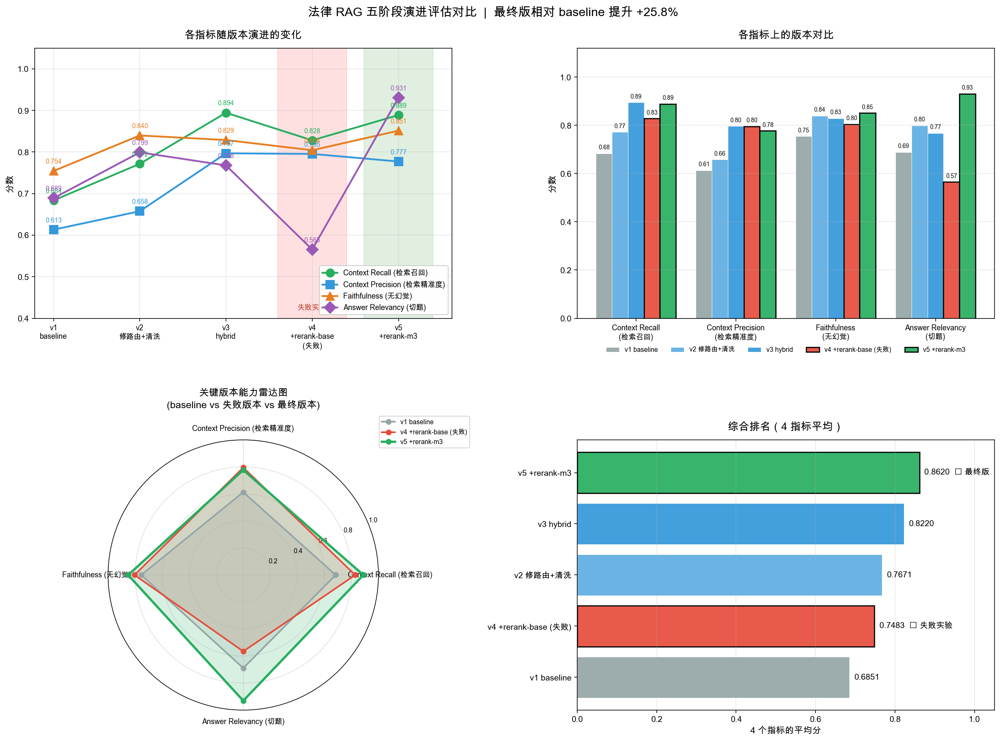

# Legal RAG System｜中国劳动法律 RAG 检索问答系统

> 基于 4 部中国劳动法律的 RAG 系统，融合 **路由 + Hybrid 检索 + Reranker + CRAG 质检**，使用 **RAGAS** 框架进行五阶段量化评估，整体性能相对 baseline **提升 25.8%**。

## 评估结果



| 版本 | 主要改动 | Faithfulness | Answer Relevancy | Context Precision | Context Recall | **平均** |
|---|---|---|---|---|---|---|
| v1 baseline | 路由 + 向量检索 + RAG-Fusion + CRAG | 0.754 | 0.689 | 0.613 | 0.684 | **0.685** |
| v2 修路由+清洗 | 修复路由 prompt + 清洗测试集 | 0.840 | 0.799 | 0.658 | 0.772 | **0.767** |
| v3 +hybrid | BM25 + 向量 + RRF 融合检索 | 0.829 | 0.768 | 0.797 | 0.894 | **0.822** |
| ❌ v4 +rerank-base | 加入 BGE-reranker-base | 0.804 | 0.566 | 0.795 | 0.828 | 0.748（**回退**）|
| ⭐ **v5 +rerank-m3** | **升级到 BGE-reranker-v2-m3** | **0.851** | **0.931** | 0.777 | 0.889 | **0.862** |

**最终版本 (v5) 相对 baseline 的提升**：
- Faithfulness：0.754 → 0.851（**+12.9%**），无幻觉答案占比大幅提升
- Answer Relevancy：0.689 → 0.931（**+35.1%**），标准差从 0.46 收敛到 0.05，稳定性接近天花板
- Context Precision：0.613 → 0.777（**+26.7%**）
- Context Recall：0.684 → 0.889（**+30.0%**）

测试集：50 个问题（RAGAS TestsetGenerator 生成 + 人工质检）｜评估器：DeepSeek-V4 + BGE 中文 embedding

---

## 为什么做这个项目

法律领域的 RAG 有两个特殊性：

1. **错误答案比"我不知道"更危险**——法律建议错误可能导致用户做错决定。所以系统必须有强幻觉抑制能力，宁愿拒答也不能编。
2. **检索精度要求极高**——法条编号、条款细节都不能错。"《劳动合同法》第 82 条"和"第 83 条"差一个字，规定完全不同。

这两个特性意味着 RAG 系统的所有优化都需要**数据驱动**，而不是凭感觉堆技术。本项目的核心价值不在于"用了多少技术"，而在于**用 RAGAS 量化每一步优化的价值，并基于诊断结果做出针对性改进**。

---

## 系统架构

```
用户问题
   ↓
┌──────────────────┐
│ 路由器 (Router)   │  判断：法条查询 / 法律咨询 / 知识库外
└──────────────────┘
   ↓ (法律咨询)              ↓ (法条查询)              ↓ (知识库外)
┌──────────────────┐    ┌──────────────────┐    ┌──────────────────┐
│ RAG-Fusion       │    │   Hybrid 检索     │    │   礼貌拒答       │
│ (多查询改写)      │    │ BM25+向量+RRF    │    │                 │
└──────────────────┘    └──────────────────┘    └──────────────────┘
   ↓                          ↓
   └────────┬─────────────────┘
            ↓
┌──────────────────────────┐
│ BGE-reranker-v2-m3       │  Cross-encoder 精排：从 16 个候选选 top-4
└──────────────────────────┘
            ↓
┌──────────────────────────┐
│ CRAG 质检                 │  LLM 逐 chunk 判断相关性，过滤无关内容
└──────────────────────────┘
            ↓
┌──────────────────────────┐
│ 法律专用 Prompt 生成      │  强约束：必须基于条文回答 + 引用条款编号
└──────────────────────────┘
            ↓
         最终答案
```

### 核心模块

| 模块 | 实现 | 解决什么问题 |
|---|---|---|
| **路由器** | DeepSeek-V3 分类 | 不同问题类型走不同检索策略，节省成本同时提升精度 |
| **Hybrid 检索** | BM25 (单字+数字+英文分词) + 向量 (BGE-small-zh) + RRF 融合 (k=60) | 法律领域条号、专业术语用 BM25 精确匹配；语义相似用向量检索 |
| **Reranker** | BAAI/bge-reranker-v2-m3 (cross-encoder) | 在 16 个候选中精排出 top-4，比 embedding 余弦相似度精度高 |
| **CRAG 质检** | LLM 逐 chunk yes/no 判断 | 过滤检索器返回但实际无关的 chunk，降低噪声干扰生成端 |
| **法律 Prompt** | 强约束模板 + 知识库外检测 | 抑制幻觉，宁可拒答不可编造 |

---

## 五阶段优化历程：数据驱动调优实录

这个项目最有价值的部分不是最终的架构，而是**到达那里的过程**。每一步都基于 RAGAS 评估数据做诊断和决策。

### Stage 1: Baseline (0.685)

跑通基础架构：路由 + 向量检索 + RAG-Fusion + CRAG。在 RAGAS 上拿到 0.685 的整体均分——这是个一般水平的起点。

**RAGAS 诊断暴露问题**：22% 的样本"双峰崩盘"——要么满分要么 0 分，标准差异常高。

### Stage 2: 修路由 + 清洗测试集 (0.767, +12%)

通过 `analyze_results.py` 定位 12 个崩盘样本，发现 **50% 的崩盘是路由器误判**：

- 把含"保险"关键词的合法问题判成"知识库外"（实际知识库里有《保险法》）
- 抽象政策问题（"劳动法如何保护劳动者"）也被错误归类

修复方式仅改两处：
1. 路由 prompt 显式列出知识库范围
2. 清洗 4 个明显有质量问题的测试样本（重复/标答错位/跨域硬拼）

**这是项目里 ROI 最高的一步**：修了 5 行 prompt + 删了 4 个 JSON 元素，整体均值涨 12%，Answer Relevancy 标准差从 0.46 降到 0.12。

> **工程教训**：在堆复杂技术之前，先看 prompt 和数据。简单的修复往往带来最大收益。

### Stage 3: Hybrid Search (0.822, +7%)

v2 的剩余崩盘集中在"漏召回精确法条"（如"保险事故通知"该召回第 21 条但纯向量召回到了 23-30 条）。

引入 **BM25 + 向量 + RRF 融合**：
- BM25 对"第二十一条"这种精确字符串极敏感
- 向量负责语义匹配
- RRF 不需要分数归一化，直接按排名融合

**结果**：Context Recall 从 0.77 涨到 0.89（+15%），Recall 标准差从 0.36 降到 0.21（-42%）——召回稳定性显著提升。

### Stage 4: ❌ Reranker-base 失败实验 (0.748, -9%)

经典的"层层堆叠"思路告诉我应该再上 reranker。引入 `BAAI/bge-reranker-base` (~280MB)，候选池从 4 扩到 8 给 reranker 更多原料。

**结果整体回退**。Answer Relevancy 暴跌 0.20（0.77 → 0.57），出现 3 个原本 hybrid 答对、reranker 后答错的新崩盘样本。

诊断发现：**bge-reranker-base 在法律领域有"字面匹配偏好"**——

- 问题"发生**事故**时延长工时是否受限"，标答指向"事故威胁劳动者生命健康"（语义层面的事故）
- reranker 把"用人单位**事故**法律责任"（字面层面的事故）排到了第一位
- 模型基于错误的 chunk 答出"无法回答"，Answer Relevancy 直接 0 分

> **工程教训**：技术堆叠不是单调上升的。reranker 不是万能精排，cross-encoder 在中文专业领域上需要选择能力更强的模型。

### Stage 5: ⭐ Reranker-v2-m3 修复 (0.862, +15%)

升级到 `BAAI/bge-reranker-v2-m3` (~600MB)，专为多语言+复杂领域优化。

**结果**：Answer Relevancy 从失败的 0.57 直接拉到 0.93，标准差 0.05。Faithfulness 也涨到历史新高 0.85。

**v4 的失败 commit 没有删除，作为反例文档保留在 git history 里**——这是工程实验记录的一部分，比掩盖实验失败更有价值。

---

## 项目结构

```
legal-rag-system/
├── README.md                  # 本文件
├── requirements.txt
├── .gitignore
│
├── src/                       # 三个版本的 RAG pipeline
│   ├── main.py                # v1: Baseline (向量检索)
│   ├── hybrid_main.py         # v3: + Hybrid 检索
│   └── hybrid_rerank_main.py  # v5: + Reranker 重排序 (最终版)
│
├── evaluation/                # RAGAS 评估套件
│   ├── config.py              # 模型、路径配置
│   ├── rag_adapter.py         # 三种策略的统一接口
│   ├── generate_testset.py    # 测试集自动生成
│   ├── run_evaluation.py      # 评估主脚本
│   ├── analyze_results.py     # 崩盘样本诊断
│   └── visualize_results.py   # 多版本对比可视化
│
├── data/
│   ├── 中华人民共和国劳动法_20181229.txt
│   ├── 中华人民共和国劳动合同法_20121228.txt
│   ├── 中华人民共和国劳动争议调解仲裁法_20071229.txt
│   ├── 中华人民共和国保险法_20150424.txt
│   └── eval/
│       ├── testset.json       # 50 个测试样本
│       └── results/           # 五个版本的 RAGAS 评估 CSV + 对比图
│
└── experiments/               # 早期 Phase 1-2 探索实验代码
    └── phase2_optimized.py
```

---

## 快速开始

### 1. 环境准备

```bash
git clone https://github.com/xxCasual/legal-rag-system.git
cd legal-rag-system
pip install -r requirements.txt
```

### 2. 配置 DeepSeek API Key

```bash
echo "DEEPSEEK_API_KEY=sk-xxx" > .env
```

DeepSeek API Key 申请地址：[https://platform.deepseek.com](https://platform.deepseek.com)

### 3. 跑 Demo

```bash
# 运行最终版本（v5 hybrid + reranker）
python src/hybrid_rerank_main.py

# 也可以试 baseline 对比
python src/main.py
```

首次运行会自动下载 BGE embedding 模型（~100MB）和 reranker 模型（~600MB）。

### 4. 跑评估（可选）

```bash
# 生成测试集（一次性，~10 分钟，DeepSeek 费用约 ¥1-3）
python evaluation/generate_testset.py

# 评估某个策略（~30-50 分钟，DeepSeek 费用约 ¥3-5）
python evaluation/run_evaluation.py --strategy hybrid_rerank --tag v5

# 分析崩盘样本
python evaluation/analyze_results.py

# 生成多版本对比图
python evaluation/visualize_results.py
```

---

## 技术栈

| 类别 | 选型 | 原因 |
|---|---|---|
| LLM | DeepSeek-V3 (deepseek-chat) | 性价比高、JSON 输出稳定、中文优秀 |
| Embedding | BAAI/bge-small-zh-v1.5 | 中文场景明显优于 OpenAI text-embedding-3，且免费本地运行 |
| Reranker | BAAI/bge-reranker-v2-m3 | 多语言+最新版，cross-encoder 精排 |
| 向量库 | Chroma | 轻量、本地持久化 |
| BM25 | rank_bm25 + 自定义中文分词 | 单字+数字+英文混合，对法律条号敏感 |
| 评估 | RAGAS 0.2+ | 行业标准的 reference-free 评估框架 |
| 框架 | LangChain 0.3 | 主流 RAG 框架 |

---

## 已知局限

- **测试集规模**：50 个样本统计意义有限，正式部署前应扩展到 200+。
- **跨法律对比类问题**：剩余崩盘集中在"同时引用《保险法》和《劳动法》"的对比型题目，需要在 multi-query 改写时强制覆盖多个法律领域，这是下一阶段优化方向。
- **未做长对话支持**：当前是单轮 RAG，多轮对话需要加 query rewriting 机制。

---

## 后续优化方向

按 ROI 排序：

1. **扩展测试集到 200+ 个样本**，提升评估统计意义
2. **针对跨法律对比题改进 multi-query**，强制每个改写版本覆盖不同法律领域
3. **引入 ColBERT 后期交互**，在长上下文场景下进一步提升精度
4. **加入对话记忆**，支持多轮上下文相关问答

---

## 联系方式

GitHub: [@xxCasual](https://github.com/xxCasual)

如果这个项目对你有帮助，欢迎 Star ⭐
